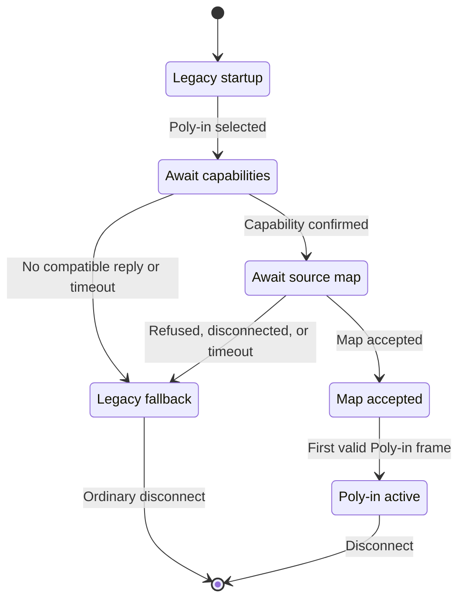

# Polyphonic input: enabling one Jamulus client to send multiple independently mixable sources

## Purpose

**Poly-in** means *polyphonic input*: it enables one Jamulus
client to send several independently mixable audio sources while retaining **one
client/server session and one return mix**. A poly-in participant might send a
mono vocal, a mono guitar and stereo keys; fellow participants see ordinary
mixer faders for those three sources, with a common base name.

This is a review guide for the architecture. The code-level control flow and
state contracts are mapped in
[`POLY_IN_IMPLEMENTATION.md`](POLY_IN_IMPLEMENTATION.md). Definitive details of
the Poly-in data-exchange protocol are in
[`JAMULUS_PROTOCOL.md`](JAMULUS_PROTOCOL.md).

> **The central model:** one participant, one network session, many visible
> sources, one downstream return mix.

## Why this matters: custom mixes

Custom mixes are a core Jamulus feature. Without them, Jamulus could easily
use a “garage-band” model: one shared mix, with levels set by source owners
through verbal consensus. Instead, Jamulus empowers each listener with a
personal mix.

That benefit currently stops at the client boundary. A participant with a vocal
and guitar must either send a premix—choosing a balance for everyone—or run
multiple clients as a workaround. Poly-in extends the existing custom-mix
model: every listener can choose the balance of those sources too.

To paraphrase Jamulus project principles: 'Stability above all', 'Keep it
simple, stupid!', 'Do one thing, well.' and 'Intuitive usage, minimizing
technical barriers'. Poly-in should be judged against those principles: it is
not an unrelated routing feature, but a focused fix / enhancement to Jamulus’
existing custom-mix model.

The multi-client workaround is not ideally suited for that usability principle.
Multiple instances require users to understand that only one of the resulting
mixer windows is relevant for listening, route the others to null or unused
playback, maintain separate profiles and channel assignments, and often use
scripts, `--nogui` or INI-file editing. That is serviceable for technical users,
but not a good model for ordinary Windows or MacOS musicians.

## The missing capability

Jamulus normally presents one remote mixer channel per connected client. That
works for one microphone or a sender-selected premix, but not where listeners
need their own balance of a vocal and instrument, two musicians share an audio
interface, or a stereo source must remain stereo alongside a microphone.

Those are recurring, specific requests in the Jamulus community—not evidence
that every user needs a more complex workflow. The feature should therefore be
optional and leave standard one-source operation unchanged. The relevant history
includes [Discussion #1063](https://github.com/jamulussoftware/jamulus/discussions/1063),
[Discussion #1840](https://github.com/jamulussoftware/jamulus/discussions/1840),
[#723](https://github.com/jamulussoftware/jamulus/issues/723), and
[#2344](https://github.com/jamulussoftware/jamulus/issues/2344).

### Why the existing workarounds are not equivalent

| Approach | What it solves | What it leaves unsolved |
| --- | --- | --- |
| Local premix | Simple single-stream setup | The sender fixes everyone’s vocal/instrument balance, mute and mono pan. |
| Input mapping | Chooses interface channels | It still produces only one remote source. |
| Server-side stereo splitting | A narrow two-mono case | It cannot represent a true stereo source or an arbitrary source map; ownership and mute semantics become unclear. |
| Multiple Jamulus instances | Multiple remote faders today | One participant must maintain separate profiles, device/channel assignments and reconnect state, then launch instances together—commonly via shell/batch scripts, `--nogui`, or INI-file editing. That can be daunting or off-putting for many Windows/macOS users; it also duplicates session/return machinery and creates several nominal clients. |

Running several instances still works. Poly-in avoids unnecessary duplication of
the participant profile, session/control state, return jitter buffer and return
stream. All of a participant’s sources share one coherent lifecycle and GUI.
Poly-in adds per-source work, but avoids duplicating whole client sessions.

### Why one session and return path matter

This is not merely GUI convenience. Jamulus must finish each mix/encode cycle
before its audio deadline. One participant running `n` simultaneous clients
creates `n` target sessions: the server builds, encodes and sends `n` return
mixes, even where an instance’s faders are all muted. Each instance also has
associated server-ingress and client-return buffering and adaptive-jitter work.

Poly-in retains unavoidable source-local work: capture, codec/conversion, fader,
decode, metering, recording and loss handling. But for `n` sources it uses one
client session, removing `n - 1` return mixes, output encodes, UDP streams,
return decoder/jitter paths and duplicate session-level work. Source/fader
capacity remains per source; client-session capacity is charged once. Fewer
target sessions mean less server work and more real-time deadline headroom.

## The model

A **physical input channel** is a local audio capture channel. A **source** is a
named mono or stereo contribution chosen from one or two such channels; each gets
a remote fader. A **session** is the single client/server connection: endpoint,
reliable control queue, timeout/ping state, return profile and return-mix
encoder; it can serve multiple sources.

A source is deliberately not a second `CClient`, socket, `CProtocol`, return
decoder, endpoint or jitter buffer. Conversely, a session is not a mixer strip:
it may comprise one standard-mode source or several Poly-in sources.

```text
Standard mode
  one participant ── one client ── one fader
                  ◄── one return mix

Several full clients
  one participant ── client A ── fader A
                  │   ◄── return mix A
                  └─ client B ── fader B
                      ◄── return mix B

Poly-in
  one participant / one client / one session
      ├─ vocal, mono      ─┐
      ├─ guitar, mono     ─┼─ multiplexed uplink ── fader per source
      └─ keys, stereo     ─┘
                  ◄──────── one ordinary return mix
```

The diagram above compares audio-stream use. The diagram below shows the
session/source split in more detail.

```text
┌──────────────────────────┐          multiplexed uplink          ┌──────────────────────────┐
│ one client process       │ ───────────────────────────────────► │ one server session       │
│ one participant/session  │                                      │                          │
│                          │                                      │ ingress / reassembly     │
│ physical inputs          │                                      │          │               │
│          │               │                                      │ visible source bank      │
│ fixed source map         │                                      │ vocal · guitar · keys    │
│          │               │                                      │          │               │
│ per-source codec work    │                                      │ ordinary server mixer    │
│          │               │                                      │          │               │
│ shared frame packetizer  │                                      │ one return encoder       │
│                          │ ◄──── ordinary return transport ──── │                          │
│ return decoder / mixer   │                                      │                          │
└──────────────────────────┘                                      └──────────────────────────┘
```

The client performs source-local capture and codec work, then sends one shared
uplink. The server exposes the sources as ordinary faders, but retains one
session and one return path for the participant.

## How it works

### Before connection

The user configures an immutable source map while disconnected. Each row selects
a mono input or a stereo pair, source tag and instrument icon. Routing is
validated before connection: the selected physical channels must exist and
cannot be silently reused by another row. The first implementation exposes
Poly-in only on capture backends that can provide a preallocated
physical-input view (ASIO, CoreAudio and JACK); other backends remain fully
functional in standard mode.

### One session, source-local audio

After ordinary standard-mode startup, a client requests the Poly-in extension
and submits its source map. Once the server accepts the source map, each
codec-frame boundary does the following:

1. Read each source from its configured physical channel(s).
2. Encode or convert it independently.
3. Place one *record* per source into a logical *session frame*, with one shared
   sequence number. For example, five sources give five records forming one
   frame: `{R1, R2, R3, R4, R5}`.
4. Packetise that frame into bounded UDP fragments. A record never spans a
   fragment. For example, the five-record frame may use three fragments:
   `{[R1, R2], [R3, R4], [R5]}`.

The server owns one physical session object and several visible source objects.
The session owns the endpoint, reliable protocol, timeout state, ingress timing
and **one** return encoder. Each visible source owns its fader ID, source tag,
decoder/conversion state, level meter, fade state and recorder identity.

At each source’s decode point for the next server mix cycle, the server takes
any available record for that source from the session’s bounded reassembly ring
and decodes it; when none is available, it applies source-local PLC or Raw
silence. It then meters and records the resulting audio, mixes all sources as
ordinary faders, and encodes one return mix for the physical session.

This separation is the key architectural answer to earlier proposals:
source work is independent where necessary, while control, timing, return audio
and connection lifecycle remain singular.

### Identity, own audio and concurrency

Remote users see meaningful source identities such as **Alice — Vocal** and
**Alice — Guitar**, derived from the session profile name plus the configured
source tag. A source cannot change its identity mid-connection.

The client tracks an *owned-source set* rather than one own-channel ID, so
own-first ordering, own-source gain/mute behaviour, auto-level exclusion and
local monitoring apply to every Poly-in source. This directly addresses the
ambiguous self-mute and identity behaviour raised by older phantom-client and
server-split approaches.

The high-priority socket worker only validates and stores a Poly-in frame in
preallocated ingress storage. The owning server thread performs the visible
transition: it retires the temporary standard-mode source, exposes all accepted
sources together, publishes the updated client list and starts the normal source
lifecycle. This avoids cross-thread protocol/timer side effects and prevents a
half-visible source map.

## Compatibility, promotion and limits

Every connection begins as an ordinary standard-mode connection. A server never
probes or changes an old client; a new client never treats a generic
acknowledgement as Poly-in support. Capability confirmation, configuration
acceptance and activation are distinct stages defined by the protocol
specification.



| Client / server pair | Result |
| --- | --- |
| Legacy client with any server | Existing one-source behaviour. |
| New client with Poly-in unselected | Existing one-source behaviour. |
| New client with Poly-in selected, old/unsupported server | No compatible reply; standard audio continues. |
| New client with capable server, rejected map | Server rejects the map; standard audio continues. |
| New client with capable server, accepted map | Temporary legacy source is atomically replaced after the first valid Poly-in frame. |

The active source map is deliberately immutable. Changing channel assignment,
source shape, tag, icon, codec policy or source count requires disconnect and
reconnect. This bounds real-time storage and avoids stale IDs, in-flight old
records, lifecycle races and ambiguous identity. Live reconfiguration can be a
later versioned transaction; it should not be hidden inside the initial
implementation.

Server capacity is explicit: `--numchannels` limits concurrent visible
sources/faders, as before, while `--numclient` limits concurrent physical client
sessions. A Poly-in participant consumes one client-session slot and one
source/fader slot per source.

## Review invariants

The implementation should be judged against these properties:

- One physical session has one endpoint, reliable-control lifecycle, timeout,
  ingress clock and return mix.
- A Poly-in session has many source-local faders/decoders/meters/recorders, but
  no cloned full client machinery.
- Source maps become visible and disappear atomically; a disconnect retires all
  sources, reservations, ingress state and endpoint lookup together.
- Records share a session sequence, never span fragments and are bounded by
  negotiated configuration. Malformed, duplicate, stale or wrong-generation
  input is rejected before it affects source decode or loss-concealment state.
- Fragment loss is as local as possible: valid records in another fragment are
  still usable; missing sources receive PLC or Raw silence.
- Mono/stereo source shape is independent, while session-wide codec/Raw policy
  keeps one clock and frame cadence.
- Old peers remain in their existing standard one-source mode safely. The
  protocol document—not this overview—defines exact messages, sizes and state
  transitions.

## What prior discussion changed in this design

| Earlier discussion | Design consequence |
| --- | --- |
| [#1063](https://github.com/jamulussoftware/jamulus/discussions/1063) and [#1840](https://github.com/jamulussoftware/jamulus/discussions/1840) | Treat separate vocal/instrument, multichannel-interface and shared-interface workflows as real but optional use cases; retain one return mix. |
| [#723](https://github.com/jamulussoftware/jamulus/issues/723) | Do not confuse local balance with independently controllable remote sources. |
| [#1909](https://github.com/jamulussoftware/jamulus/pull/1909) and [#1913](https://github.com/jamulussoftware/jamulus/pull/1913) | Do not defer source identity, self-mute and delay/pan behaviour behind a phantom-client transport shortcut. |
| [#2344](https://github.com/jamulussoftware/jamulus/issues/2344) and [#3746](https://github.com/jamulussoftware/jamulus/pull/3746) | Keep physical capture mapping separate from remote source representation; limit early backend support to paths that can be tested safely. |
| [#3757](https://github.com/jamulussoftware/jamulus/pull/3757) | Avoid cloned clients and a dual-mono-only model; retain mono, stereo and Raw coverage through a general source/session abstraction. |

These references record inputs, not endorsements by their authors of this
particular implementation.

## Fair criticisms

Poly-in adds code complexity. It increases protocol, server-state and
compatibility-test surface; needs hardware testing; consumes real
fader/decoder/recording capacity; and makes live routing changes less
convenient. Some users will reasonably prefer premixing or multiple instances.

Those are valid constraints. The justification for Poly-in is not simplicity;
it is that a general, opt-in session/source model addresses the recurring
workflows without pretending that multiple independent sources are one audio
stream, or paying for several complete Jamulus sessions to represent one
participant.
