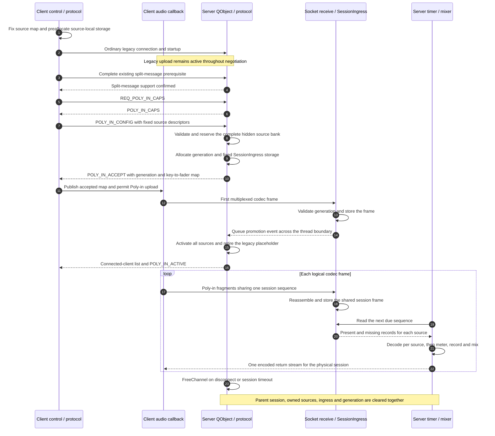
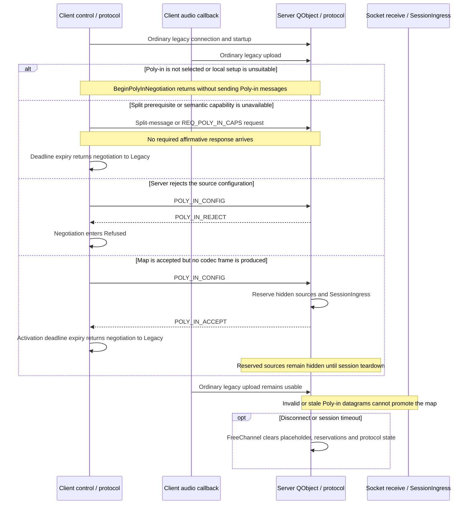
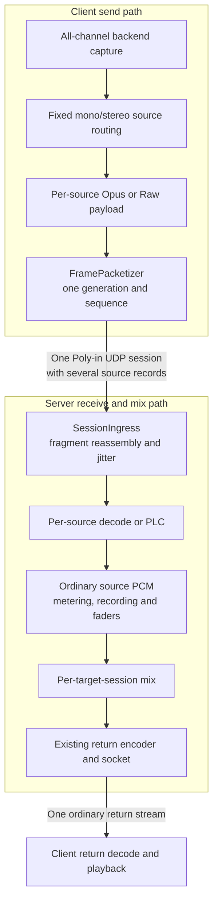

# Poly-in implementation guide

## Scope

This document maps the Poly-in architecture onto the Jamulus implementation. It
assumes the reader has already read [`POLY_IN.md`](POLY_IN.md) and the Poly-in
section of [`JAMULUS_PROTOCOL.md`](JAMULUS_PROTOCOL.md).

It therefore does not repeat the motivation or wire format. Its purpose is to
answer the implementation questions most likely to arise during review:

- where Poly-in enters the existing client and server control flow;
- which state belongs to a physical session and which belongs to a visible
  source;
- what the main Poly-in functions establish for their callers;
- why reservation, first-audio promotion and shared ingress are separate steps;
- where compatibility and cleanup return to the legacy path.

## Suggested review order

| Step | Concern | Principal code |
| --- | --- | --- |
| 1 | Fixed wire/storage primitives and negotiation state | `src/polyinwire.{h,cpp}`, `tests/polyinwire_test.cpp` |
| 2 | Reliable control-message encoding and dispatch | `src/polyin.{h,cpp}`, `src/protocol.{h,cpp}`, `src/channel.{h,cpp}` |
| 3 | Client configuration, capture and preallocation | `src/client.{h,cpp}`, `src/clientsettingsdlg.cpp`, `src/settings.cpp`, `src/sound/` |
| 4 | Client negotiation and multiplexed uplink | `CClient::BeginPolyInNegotiation()`, `CClient::SendPolyInFrame()` |
| 5 | Server session/source split and promotion | `CServerSource`, `CServerSessionState`, `CServer::PreparePolyInSources()`, `CServer::customEvent()` |
| 6 | Server ingress, decode, mix and return | `CServer::ReadPolyInFrame()`, `DecodeReceiveData()`, `MixEncodeTransmitData()` |
| 7 | Visible ownership, lifecycle and limits | `ApplyNewConClientList()`, `CAudioMixerBoard`, `FreeChannel()`, `--numclient` |

## Runtime model and identifiers

The implementation keeps four identifiers distinct:

| Identifier | Scope | Meaning |
| --- | --- | --- |
| `sessionID` | Server-private | Slot in `vecSessions`; owns the endpoint, reliable protocol, timeout, return profile and return encoder. |
| `sourceID` / fader ID | Server-public | Slot in `vecSources`; also the ordinary mixer-channel ID used in client lists, gain/pan matrices and recording. |
| source key | One negotiated session | Stable row key carried in Poly-in control and audio records; maps a record to its reserved source. |
| generation | One accepted source map | Rejects delayed UDP from an earlier map after keys, endpoint or slots are reused. |

The corresponding objects are:

- `CChannel` in `vecSessions`: the existing physical Jamulus connection. Poly-in
  does not clone it.
- `CServerSessionState`: Poly-in state attached to that connection, including
  its source IDs, generation, shared ingress ring and playout cursor.
- `CServerSource` in `vecSources`: one visible mixer/decoder/recorder source.
  A legacy session has one; an active Poly-in session has several.
- `CClientPolyInSource`: one configured client source with routing, source-local
  PCM/codec storage and its accepted fader ID.
- `PolyIn::Negotiation`: the client-side cross-thread state machine deciding
  whether the audio callback may use the Poly-in transport.

This split is reflected in the server timer: input is enumerated and decoded by
**source**, while output is mixed and encoded by **target session**. That is the
structural reason several incoming faders still produce one return stream.

## What changes in the existing control flow

The diagrams below are implementation maps rather than protocol definitions.
They show which execution context performs each transition; the normative wire
rules remain in [`JAMULUS_PROTOCOL.md`](JAMULUS_PROTOCOL.md).

### Successful activation timeline



The important boundary is the first valid Poly-in frame. `POLY_IN_ACCEPT`
permits the client to send it, the socket worker stores it, and only the queued
server-thread event makes the hidden source bank visible.

### Inactive, unsupported or refused timeline



Thus an old server, a policy refusal and a client which never emits Poly-in
audio all retain the ordinary session path. No fallback case requires converting
partially visible Poly-in sources back into a legacy fader.

### Audio data path



The client and server therefore share sequence, fragmentation and ingress jitter
at session level, while codec state, PLC, metering, recording and mixer identity
remain source-local. The return side continues to operate once per physical
session.

### 1. Configuration and capture are fixed before connection

The source table is edited through `CPolyInAudioChannelsDlg`, persisted by
`CSettings`, normalised by `CClient::SetPolyInAudioChannels()` and materialised
by `CClient::ConfigurePolyInSources()`.

`CClient::Start()` locks the selected source map before starting the sound card
or network connection. `CClient::Init()` then allocates all source-local PCM,
codec and packet storage. A setting that would invalidate those allocations or
the accepted descriptors is rejected until disconnect.

The ordinary sound callback still carries the selected legacy stereo pair used
for standard mode and for the single return path. Poly-in-capable backends also
publish a preallocated interleaved view of every physical capture channel
through `CSoundBase::SetCapturedInputAudio()`:

- ASIO, CoreAudio and JACK advertise `SupportsPolyInCapture()` and populate that
  view before invoking the common callback;
- other backends retain their existing standard-mode behaviour and never enter
  Poly-in negotiation.

`CClient::ProcessSndCrdAudioData()` preserves the all-channel view through any
sample-rate conversion buffering. No source routing or allocation is performed
inside the real-time callback.

### 2. Every connection still starts as a legacy connection

The existing connectionless audio path reaches `CServer::FindChannel()` and
`CServer::InitChannel()`. Admission now checks both physical-session capacity
and visible-source capacity. A successful admission creates:

- one connected `CChannel` session; and
- one active legacy `CServerSource` placeholder owned by that session.

The placeholder is intentional. It gives old peers their unchanged startup
path, lets a new client continue sending ordinary audio during negotiation and
ensures the participant remains represented if negotiation is refused or times
out.

On the client, `CClient::OnNewConnection()` sends the existing startup messages
and then calls `BeginPolyInNegotiation()`. Until a valid `POLY_IN_ACCEPT` is
processed, `ProcessAudioDataIntern()` continues through the ordinary legacy
upload branch.

### 3. Negotiation is tied to actual reliable-message transmission

Poly-in configuration may require the existing split-message extension. The
client therefore observes these stages separately:

```text
split support observed
    -> capability request queued
    -> capability request physically sent
    -> semantic capability response received
    -> configuration queued
    -> configuration physically sent
    -> configuration accepted
```

`CProtocol::ReliableMessageSent` is emitted when the first physical datagram for
a logical reliable message is handed to the socket. `CClient` starts each
response deadline from that event, not when a message merely enters the
ACK-gated reliable FIFO. This avoids timing out behind earlier startup traffic.

`PolyIn::Negotiation` is atomic because protocol callbacks and the audio callback
both inspect or advance it. Its relevant contract is:

- `Legacy`, `Refused` and all pre-acceptance states permit only legacy upload;
- `Prepared` means a validated `POLY_IN_ACCEPT` supplied a non-zero generation
  and stable fader map, so multiplexed upload is permitted;
- after the first successfully packetised frame, the client enters
  `AwaitingActivation`;
- an activation-confirmation timeout does not revert a live Poly-in uplink,
  because the first frame may already have promoted the server map even if the
  reliable `POLY_IN_ACTIVE` reply was lost.

### 4. Accept reserves a complete hidden source bank

`CServer::OnPolyInConfig()` delegates to `PreparePolyInSources()`. That function
validates the fixed session-wide codec/Raw policy, checks logical and fixed-pool
capacity, and then reserves every requested `CServerSource` before replying.

Reservation is all-or-nothing:

- each reserved `sourceID` is already its final public fader ID;
- gain/pan matrix slots are initialised immediately;
- reserved sources remain absent from `CreateChannelList()`;
- the legacy placeholder remains active;
- any allocation or ingress-configuration failure frees every reservation.

Only after all reservations and the fixed-capacity `SessionIngress` succeed does
the server enter `ST_PREPARED` and send `POLY_IN_ACCEPT` with the generation and
source-key-to-fader mapping.

Reserving before acceptance avoids two harder alternatives: changing fader IDs
after the client has started sending, or accepting a map which can later fail
part-way through public activation.

### 5. The client audio callback creates one logical session frame

Once `PolyIn::Negotiation::CanSendPolyIn()` is true,
`CClient::ProcessAudioDataIntern()` calls `SendPolyInFrame()` at each codec-frame
boundary.

`SendPolyInFrame()`:

1. extracts mono or stereo PCM for every configured row from the common captured
   input block;
2. applies mute and source-local encoding/Raw conversion into preallocated
   storage;
3. creates one `RecordView` per source, all carrying the same logical sequence;
4. asks `PolyIn::FramePacketizer` to divide the complete frame into bounded UDP
   datagrams without splitting a source record;
5. sends every datagram and advances the session sequence.

`FramePacketizer` owns fixed output storage, so this path neither allocates nor
constructs one socket/queue per source. `OnFirstAcceptedFrame()` changes only the
negotiation state used for confirmation; `POLY_IN_ACCEPT`, not
`POLY_IN_ACTIVE`, is the permission to transmit.

When “Mute Myself” is active, the outgoing records are muted and
`AccumulatePolyInLocalMonitor()` builds the local sidetone from the same
source-local PCM. Per-source gain and pan are updated from the owned server
faders, avoiding a return-path dependency for self monitoring.

### 6. The socket worker stores first audio but does not publish sources

`CServer::PutAudioData()` tests the Poly-in magic before legacy admission. This
prevents an extension datagram from an unknown endpoint accidentally creating a
standard session. Once a session is active, delayed legacy audio is discarded
so two transports cannot advance competing ingress timelines.

For a prepared or active session, `PutPolyInAudioData()`:

- resolves the existing endpoint to its `sessionID`;
- validates the fragment and accepted generation;
- stores it in the session's preallocated `SessionIngress` ring;
- resets the physical session timeout;
- records one arrival observation for the first fragment of a logical frame;
- on the first prepared frame, queues promotion.

The high-priority receive thread deliberately stops there. It does not activate
faders, publish a client list or enqueue a reliable protocol message, because
those operations belong to `CServer`/`CProtocol`'s QObject thread.

`QueuePolyInPromotion()` posts a custom event. The first frame is already owned
by `SessionIngress`, so deferring the visible transition cannot lose the audio
which justified it.

### 7. Promotion atomically replaces the placeholder

The promotion custom event runs under the server mutex in
`CServer::customEvent()` and calls `ActivatePreparedSources()`.

Activation performs one state transition:

```text
ST_PREPARED
  legacy source active
  Poly-in sources reserved and hidden
        |
        | first valid accepted-generation audio
        v
ST_ACTIVE
  all Poly-in sources active
  legacy source freed
```

All reservations are activated before the legacy source is retired. Only after
that function returns does the event handler:

1. publish one new connected-client list containing the complete source bank;
2. send the session-level jitter target when required; and
3. send `POLY_IN_ACTIVE`.

Peers therefore see either the legacy placeholder or the complete Poly-in map,
never a partially promoted subset. First-audio promotion also avoids publishing
empty faders for a client which negotiated successfully but never switched its
audio transport.

### 8. One shared ingress frame feeds source-local decode

`PolyIn::SessionIngress` belongs to the physical session. It reassembles
fragments into a sequence-indexed ring whose records are indexed by negotiated
source descriptor. Its storage is allocated during preparation and is not
resized by the audio thread or by later jitter-policy changes.

In `CServer::OnTimer()` each active Poly-in session advances that shared playout
cursor according to the server/codec frame-size pairing. `ReadPolyInFrame()`
then copies record references for the requested sequence into the existing
per-source decode slots.

The shared ring is necessary because sequence, fragmentation, arrival timing and
jitter policy describe one multiplexed session frame. Decode remains
source-local:

- a present record is decoded by that source's decoder;
- a missing compressed record invokes that source's Opus PLC;
- a missing Raw record becomes silence;
- records which arrived in another fragment remain usable.

Long producer/consumer discontinuities re-anchor the session cursor rather than
waiting for a modulo ring position which can no longer be reached. Automatic
jitter statistics count logical-frame arrivals, not every fragment or source.

### 9. Decode is per source; return encoding is per session

The timer builds two independent active lists:

- `vecChanIDsCurConChan`: active source/fader IDs;
- `vecSessionIDsCurConSession`: connected physical session IDs.

`DecodeReceiveData()` iterates the source list. For legacy sources it reads the
existing `CChannel` socket buffer; for Poly-in sources it consumes the payload
staged by `ReadPolyInFrame()`. The resulting PCM then follows the ordinary
metering, recording, fade and mixing path.

`MixEncodeTransmitData()` iterates the target-session list. For one target
session it mixes every active source using that session's existing gain/pan
matrix, then encodes and sends exactly one return stream using the target
`CChannel`'s negotiated return profile.

The OPUS64 return-cadence helper is part of this same contract: a 128-sample
server tick must emit two 64-sample packets when the target session negotiated
OPUS64, while the inverse frame-size pairing continues through the existing
conversion buffer.

### 10. Source ownership is reconstructed from ordinary client lists

`POLY_IN_ACCEPT` gives the client the server fader IDs it owns, but those faders
are not visible until promotion. `CClient::SetOwnedSourceIDs()` records the
server-ID set immediately; `ApplyNewConClientList()` resolves it again after the
ordinary connected-client list creates client-local mixer indices.

`CAudioMixerBoard::SetMyChannelIDs()` replaces the previous single-own-channel
assumption with an ownership set plus negotiated order. Existing operations then
use that set for:

- own-fader-first ordering;
- “Mute Myself” and own-source gain behaviour;
- automatic new-fader and auto-level exclusions;
- local monitor gain and pan updates.

No special remote fader type is introduced: after promotion, Poly-in sources are
ordinary server mixer channels with a shared parent session.

## Principal function contracts

| Function | Preconditions | Success establishes |
| --- | --- | --- |
| `CClient::ConfigurePolyInSources()` | Disconnected/reinitialising; fixed routing rows and audio profile available | Valid source rows have all callback-time PCM, codec and payload storage allocated; invalid rows cannot enter negotiation. |
| `CClient::BeginPolyInNegotiation()` | Ordinary connection established | Legacy upload continues while semantic split and Poly-in capability are tested. |
| `CClient::SendPolyInFrame()` | Negotiation is sendable; captured input and source storage match the accepted map | One complete shared-sequence frame is packetised and sent without dynamic allocation. |
| `CServer::PreparePolyInSources()` | Connected legacy session; split support confirmed; valid fixed source map | Complete hidden source bank, stable fader IDs, generation and ingress storage exist, so `POLY_IN_ACCEPT` is safe to send. |
| `CServer::PutPolyInAudioData()` | Existing prepared/active session and matching generation | Valid fragment is owned by the session ingress ring; no visible state is changed in the socket thread. |
| `CServer::ActivatePreparedSources()` | Prepared state and matching generation, called from the queued server event | Every reserved source is active, the placeholder is retired and the session playout cursor starts at the first accepted sequence. |
| `CServer::ReadPolyInFrame()` | Active session; one logical sequence due for playout | Per-source payload-presence slots represent that sequence; shared jitter/sequence state advances once. |
| `CServer::DecodeReceiveData()` | Active source ID selected by the timer | One source produces PCM through normal decode/PLC, metering, fade and recording semantics. |
| `CServer::MixEncodeTransmitData()` | Connected target session and decoded active-source PCM | All source faders are mixed through the target's gain/pan matrix and one return stream is encoded for that session. |
| `CServer::FreeChannel()` | Valid physical session slot | Protocol/endpoint state, every active or reserved child source, ingress generation and lookup order are retired together. |

## State and cleanup summary

### Client

| State range | Upstream transport | Exit |
| --- | --- | --- |
| `Legacy` / pre-acceptance | Ordinary legacy packet | Capability/configuration success, refusal or timeout |
| `Prepared` | Poly-in packet permitted | First successfully sent accepted-generation frame |
| `AwaitingActivation` | Poly-in packet | Matching `POLY_IN_ACTIVE`; timeout retains live Poly-in transport |
| `Active` | Poly-in packet | Disconnect or forced audio reinitialisation |
| `Refused` | Ordinary legacy packet | Disconnect/reconnect |

### Server

| State | Visible sources | Accepted audio |
| --- | --- | --- |
| `ST_LEGACY` | One legacy placeholder | Legacy |
| `ST_PREPARED` | Legacy placeholder only; Poly-in bank hidden | Legacy plus accepted-generation Poly-in used to trigger promotion |
| `ST_ACTIVE` | Complete Poly-in source bank | Poly-in; delayed legacy packets discarded |

`CServer::FreeChannel()` resets the parent `CChannel`, frees every source whose
`ParentSessionID()` matches, resets `CServerSessionState` and returns the session
slot to endpoint-order lookup. This same path covers explicit disconnect and
sample-based timeout recovery.

The two configured limits intentionally count different resources:

- `--numchannels`: the post-promotion visible source/fader count;
- `--numclient`: physical sessions and therefore return streams.

A prepared map temporarily coexists with its legacy placeholder in the fixed
source pool, but admission is checked against the post-promotion logical source
count.

## Focused verification

`tests/polyinwire_test.cpp` exercises code which can be isolated from Qt and the
full audio engine:

- packetisation, parsing and the Raw flag;
- fragment loss with surviving source records;
- malformed, duplicate and stale input rejection;
- negotiation fallback and activation semantics;
- ingress auto-jitter, re-anchoring and long-discontinuity recovery;
- return packet cadence;
- upload-rate estimation;
- routing validation.

Integration review should additionally follow these end-to-end cases through
the functions above:

1. **Unsupported server:** legacy startup, no semantic capability response,
   timeout, continued legacy audio and no reserved server sources.
2. **Accepted map, no Poly-in audio:** hidden reservations remain invisible and
   are removed on disconnect/timeout.
3. **Successful promotion:** first frame is stored, queued promotion swaps the
   complete source bank, client list resolves all owned faders, and one return
   stream continues.
4. **Partial fragment loss:** available source records decode normally while
   only missing sources receive PLC/silence.
5. **Reconnect:** old generation, ingress contents, fader ownership and reliable
   messages cannot survive slot reuse.
